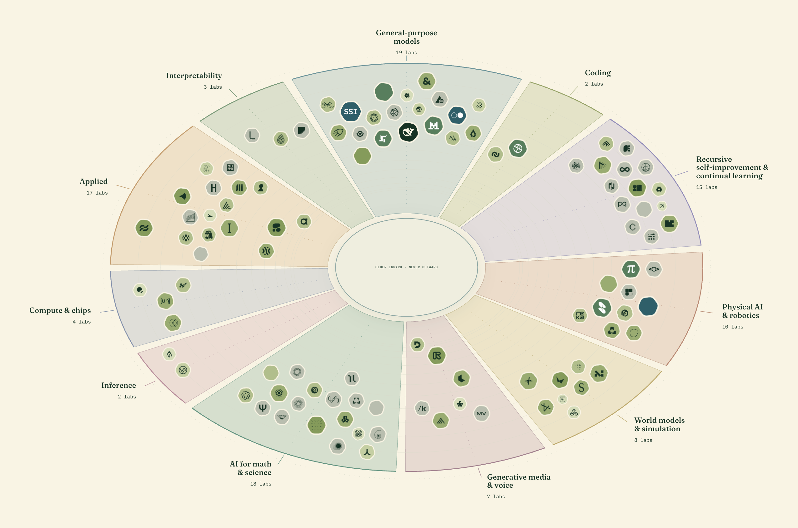

<picture>
  <source media="(prefers-color-scheme: dark)" srcset="assets/readme/wordmark-dark.png">
  
</picture>

 

<picture>
  <source media="(prefers-color-scheme: dark)" srcset="assets/readme/research-ring-dark.png">
  
</picture>

---

Initially made to play around with [Parallel](https://parallel.ai/) web search tooling since I had a bunch of credits to burn. Turned into a full-blown data visualization project.

Such is the way of things.

## Prompts

- [**Add a new neolab**](prompts/add-new-neolab.md)
- [**Convert a logo PNG to SVG**](prompts/convert-png-to-svg.md)
- [**Valuation methodology**](prompts/valuation-methodology.md)
